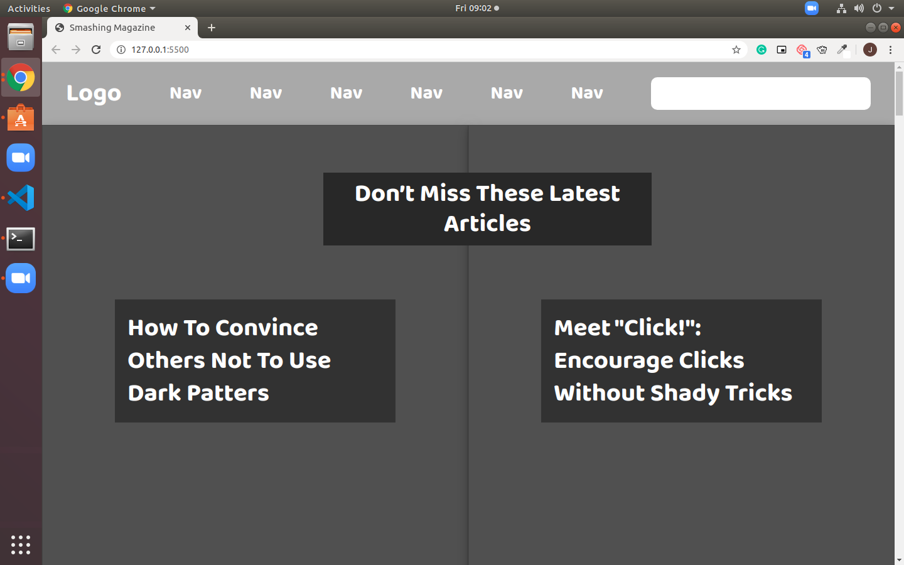

# Design-Teardown

> A Design Teardown of the Smashing Magazines homepage.

Page is a basic greyscale teardown of the smashing magazine homepage, the darker the shade of grey represents the more focus is on that element of the page. 

## Built With

- HTML5
- CSS3

## Live Demo

Live link here: https://rawcdn.githack.com/jacobrees/Design-Teardown/b4288a60ea865929d51ac3155792daef508dab52/index.html

## Authors

👤 **Author1**
Ignatius Sani:
- Github: https://github.com/ignatius22 
- Linkedin: https://www.linkedin.com/in/ignatius-sani-982b8b186/  

👤 **Author2**
Jacob Rees:
- Github: https://github.com/jacobrees
- Linkedin: https://www.linkedin.com/in/jacob-rees-a6507b1a6/
